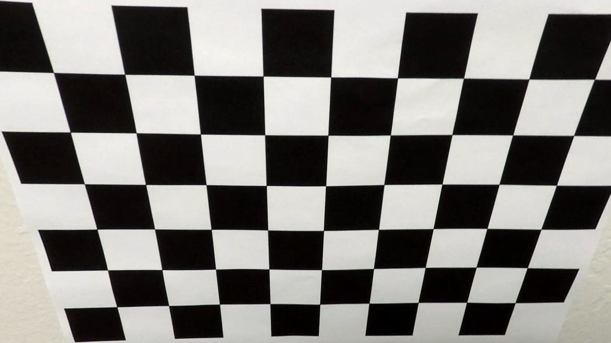

# Lane Finding Project

The steps of this project are the following:

* Compute the camera calibration matrix and distortion coefficients given a set of chessboard images.
* Apply a distortion correction to raw images.
* Use color transforms, gradients, etc., to create a thresholded binary image.
* Apply a perspective transform to rectify binary image ("birds-eye view").
* Detect lane pixels and fit to find the lane boundary.
* Determine the curvature of the lane and vehicle position with respect to center.
* Warp the detected lane boundaries back onto the original image.

## 1. Camera Calibration
 

## 2. Apply a distortion correction to raw images.

## 3. Create a thresholded binary image

## 4. Apply a perspective transformation

## 5. Fit a polynomial 

## 6. Mark the detected lane in the orignal image

